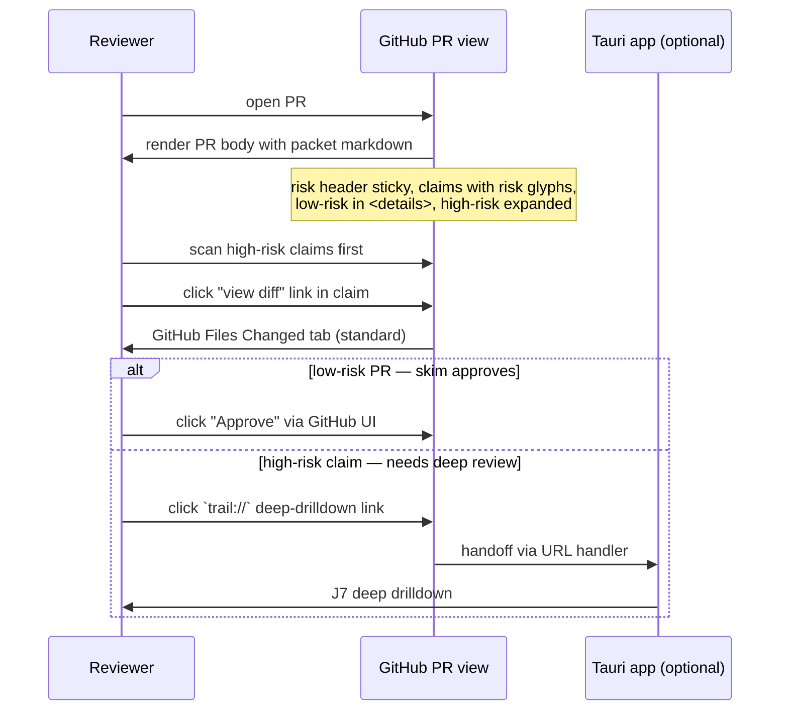
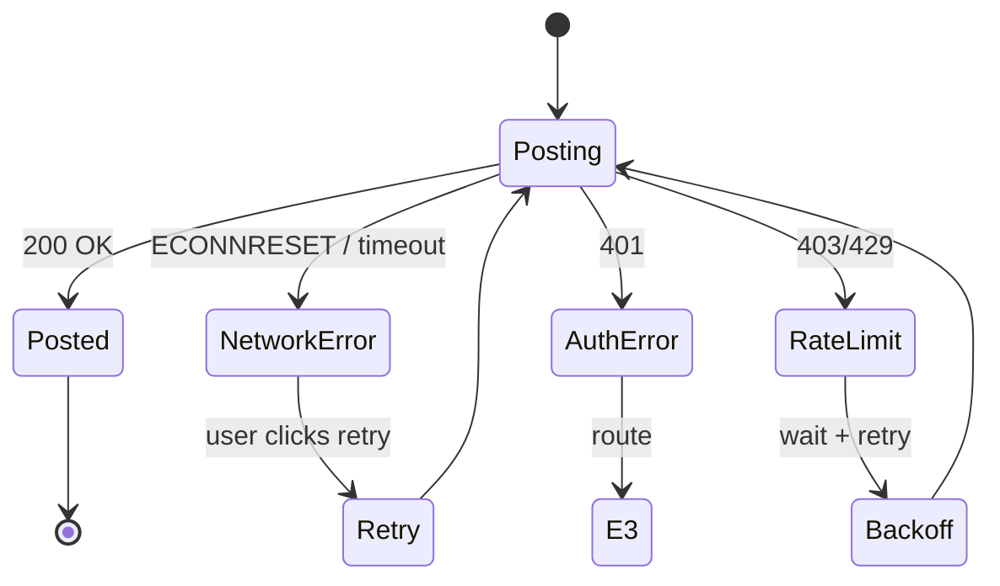

# Phase 2 UI — Interaction Flows (B2)

**Status**: B2 draft
**Date**: 2026-05-09
**Authoritative**: this document
**Scope**: Phase 2 (Tauri + React UI scaffold for v0.1 OSS MLP)
**Blocks**: B3 (design system), B4 (screen specs)
**Blocked by**: B1 ✓ (`docs/specs/phase-2-ui-stories.md`)
**Personas, stories**: see B1 §1, §3–§5
**Architecture references**: `docs/architecture.md` §Layer 3 (UI), §Layer 2 (storage)
**Companion canvas update**: `.claude/canvas/scenarios.yml` populated alongside this doc

---

## §1 Architecture & flow notation

### 1.1 Surfaces in v0.1

Trail v0.1 has four interaction surfaces. Phase 2 ships the **Tauri app**; the others are referenced for cross-surface flows.

| Surface | Scope in v0.1 | Phase | Persona primary use |
|---|---|---|---|
| **Tauri desktop app** (`apps/ui` — Tauri 2.x + React + Vite) | Packet view, trail browser, redaction-audit panel, decision capture, settings | Phase 2 (this) | Creator (capture/post), Reviewer (deep drilldown), Auditor (browse/resume) |
| **CLI** (`apps/capture` — TS port of py-reference) | `trail packet generate`, `trail packet post`, `trail packet decide` | Phase 1 + Phase 3a/b | Creator (initial capture, posting), Reviewer (CLI-mode decisions) |
| **GitHub PR view** (markdown body) | Markdown render of packet posted via `trail packet post` | Phase 3b | Reviewer (skim review) |
| **Filesystem** (`.trail/` directory) | YAML packets + libSQL store + redaction-audit logs | Phase 1 (writes) + Phase 2 (reads) | All personas (read); Creator (writes via UI); Reviewer/Auditor (reads only via UI) |

GitHub App (status checks, deep-link return), cloud sync, multi-tenant team UI: all v0.2+ (Phase 5+ commercial product).

### 1.2 Storage substrate (v0.1 solo OSS)

Per `docs/architecture.md` §Layer 2:
- **Provenance store (2a)**: local libSQL at `.trail/trail.db` — single user, offline-capable, queryable.
- **Review state store (2b solo equivalent)**: same `.trail/trail.db` (commercial DOs not relevant in v0.1).
- **Canonical artifact**: YAML packet at `.trail/sessions/<session-id>/packet.yml` (Phase 1 output, byte-identical-to-py-reference). The YAML is the git-committed source of truth; the libSQL is a derived index.

**Implication for flows**: every UI write must update both the YAML (for git) and the libSQL (for query). Phase 2 picks the implementation; B2 specifies the contract via the StorageWriter seam from `phase-1-capture.md` Appendix A.

### 1.3 Notation

Flows in this doc use three forms:

1. **Numbered steps** — primary spec format. Every flow has them. Each step is one of:
   - `User:` user action
   - `UI:` UI response (rendered output, navigation, state change)
   - `Backend:` Tauri Rust shell action (filesystem, subprocess, IPC)
   - `External:` Phase 1 CLI / `gh` CLI / git
2. **Mermaid sequenceDiagram** — used for cross-surface flows where the surface boundaries matter (J7, J9, redaction preview).
3. **State diagrams** — used for stateful flows (decision lifecycle, post-to-PR retry).

Story IDs from B1 are referenced inline (e.g., `[CR-RC-01]`). One flow can cover multiple stories; one story can be split across flows.

### 1.4 Flow primitives (reusable across journeys)

These primitives appear inside multiple journey flows. Defining them once here.

#### P1 — Open packet
**Trigger options**: filesystem watcher fires; user clicks a packet in trail browser; URL handler `trail://packet/<id>` opens app from browser; CLI invocation `trail open <session-id>`.
1. Backend: read `.trail/sessions/<session-id>/packet.yml` (canonical) and the matching libSQL row.
2. Backend: validate schema (Ajv, per `phase-1-capture.md` §7) — on error route to **E4 Malformed packet**.
3. Backend: compute content hash of approval_trail block; compare to stored hash in libSQL → on mismatch route to **E2 / J12 tamper warning**.
4. UI: render packet view (CR-UI-03 summary panel + claim list).
5. UI: register filesystem watcher on the packet file for auto-reload.

**Performance budget**: 200ms from trigger to summary panel rendered (per CR-UI-03 acceptance).

#### P2 — Save decision (atomic write contract)
**Trigger**: user clicks accept / override / reject / block on a claim, or sets a risk override.
1. UI: optimistically update local React state (immediate visual feedback).
2. Backend: receive IPC with `{ packet_id, claim_id, decision, reason?, by, at }`.
3. Backend: append to libSQL approval_trail table (transaction).
4. Backend: regenerate YAML packet with updated approval_trail block (atomic write per `phase-1-capture.md` §3 step 10: tmp + rename).
5. Backend: recompute content hash of approval_trail block; persist to libSQL.
6. Backend: emit IPC event `decision-saved` with new state.
7. UI: confirm visual state (no rollback needed); enable next action.
8. **On any backend failure**: rollback libSQL transaction; emit IPC `decision-failed` with reason; UI rolls back optimistic state and surfaces error inline.

**Atomicity rule**: libSQL transaction commits BEFORE YAML rename succeeds, OR YAML write fails and libSQL is rolled back. No state where libSQL says X and YAML says Y.

**Performance budget**: 100ms from click to optimistic UI update; 500ms to durable confirmation.

#### P3 — Sync to GitHub (Phase 3b dependency)
**Trigger**: user clicks "Post to PR" or "Re-post to PR" (CR-GH-01, CR-GH-02), or reviewer records a decision when configured to push (RV-AT-03 GitHub-side path).
1. Backend: shell out to `gh auth status` → on fail route to **E3 GitHub auth fail**.
2. Backend: detect PR number from current branch (`gh pr view --json number`); on no PR, prompt user.
3. Backend: render packet markdown via TS port of `cli/render.py` (Phase 1 output).
4. Backend: read existing PR body; locate `<!-- trail:packet:start -->` … `<!-- trail:packet:end -->` fenced section.
5. Backend: replace fenced section (or insert at end if absent); preserve everything outside.
6. Backend: PATCH PR via `gh api repos/.../pulls/N --method PATCH -f body=...`.
7. Backend: append `posted_to_pr` history entry to packet (P2 atomic-write).
8. UI: toast confirmation with PR URL link.

**Failure modes**: auth (E3), network (E7), PR-not-found, rate limit (surface as user-actionable error).

#### P4 — Filesystem watch (auto-reload)
1. Backend: on app launch and on directory change, watch `.trail/` recursively (Tauri `notify` crate).
2. Backend: debounce (200ms) — agent capture pipeline may write in bursts.
3. Backend: on packet.yml change, emit IPC `packet-changed` with session ID.
4. UI: if currently open, re-render via P1 Open packet (only the changed packet); else, refresh trail-browser timeline if visible.

**Resolves**: B1 OQ-B2-1 (passive vs explicit). Decision: **passive watcher** for currently-open packets and trail browser; explicit-only for opening new packets (no auto-jump). Rationale: dogfood loop runs many capture cycles per session; watching is the low-friction path. Explicit-jump would yank focus.

---

## §2 Cross-cutting flows

### 2.1 Application launch + first-run

**Trigger**: user double-clicks Tauri app icon, or runs `trail open` from CLI.

1. Backend: detect working directory. Default = directory passed via CLI arg, else last-used (settings), else prompt.
2. Backend: scan for `.trail/` in working directory.
3. **Branch A — `.trail/` exists with packets**:
   1. Backend: read libSQL index; load packet metadata.
   2. UI: open with **trail browser** (timeline view) as default landing surface.
4. **Branch B — `.trail/` exists but empty (or libSQL only)**:
   1. UI: open with **first-run state** (E1, see §6.1).
5. **Branch C — no `.trail/` directory**:
   1. UI: open with **no-trail state** (sub-variant of E1) — CTA: "Run `trail packet generate` from your project to get started."

**Settings persistence**: `~/.trail/settings.json` keeps last-used directory, dark mode, keyboard shortcut overrides.

### 2.2 Open packet (entry-point variants)

Three entry points; all converge on P1 Open packet primitive.

| Entry point | Source | Story |
|---|---|---|
| Trail browser click | UI navigation | AU-UI-01 |
| Filesystem watcher | Auto-reload on `.trail/` change | CR-UI-03 currentness |
| URL handler `trail://packet/<id>` | External link from GitHub PR body | RV-UI-03, J7 |
| CLI `trail open <session-id>` | Terminal | All personas |

For URL handler, the `<id>` resolves to a session ID (ULID). On unknown ID: **E2 Schema/data mismatch** error path.

### 2.3 URL handler registration

1. On first launch, Tauri shell registers `trail://` scheme (macOS `Info.plist`, Linux `.desktop`, Windows registry).
2. Inbound `trail://packet/<id>` opens or focuses the app and triggers P1 Open packet on `<id>`.
3. Inbound unknown URL forms display a graceful error.

This is a Phase 2 deliverable but is consumed by Phase 3b (GitHub markdown render emits `trail://` links).

### 2.4 Save decision (atomic-write detail)

See P2 above. The contract is critical for AU-AT-01 tamper detection: every approval-trail mutation must result in (a) an updated YAML, (b) an updated libSQL row, (c) an updated content hash, all-or-nothing.

---

## §3 Creator flows

### 3.1 J1 — Capture-to-post happy path

**Stories covered**: CR-RC-01, CR-AT-01, CR-UI-01, CR-UI-03, CR-GH-01.
**Trigger**: Creator finishes a Claude Code session and runs `trail packet generate <session-id>` (or has filesystem watcher pick up a new packet).
**Preconditions**: working directory is a git repo; Claude Code session transcript exists; `.trail/` writable.

1. External: Creator runs `trail packet generate` (Phase 1 CLI). YAML written to `.trail/sessions/<session-id>/packet.yml`; libSQL row written.
2. Backend: filesystem watcher fires (P4); emits `packet-changed`.
3. UI: trail browser surfaces a "new packet captured" toast with click-to-open link.
4. User: clicks toast.
5. UI → P1 Open packet → packet view rendered (summary panel CR-UI-03 + claim list).
6. UI: summary panel shows: risk histogram, claim count, redaction count, approval state ("0 of N decided"), "not yet posted to PR."
7. User: scans summary; spots a HIGH-risk claim flagged.
8. User: clicks the HIGH claim → claim detail panel expands inline.
9. UI: claim detail shows claim text, risk + rationale, evidence links (diff hunk + test result + command output) — CR-UI-01.
10. User: clicks evidence link → diff hunk view scrolls into focus with syntax highlighting.
11. User: scans the hunk; satisfied; clicks "accept" on the claim.
12. UI → P2 Save decision → decision persisted; UI shows accepted state.
13. User: keyboard-shortcut steps through remaining claims (j/k or n/p) — RV-UI-01 reused.
14. User: accepts all; summary panel updates "N of N decided."
15. User: clicks "Post to PR" — CR-GH-01.
16. UI → P3 Sync to GitHub → posted; toast confirms with PR URL.

**Success state**: PR body now contains the packet markdown; `posted_to_pr` history has one entry; all claims have `creator` accept decisions.

**Failure paths**:
- Step 2 fails (watcher misses): user opens trail browser explicitly → packet visible there.
- Step 5 P1 fails (malformed): E4.
- Step 12 P2 fails (write error): UI rolls back optimistic state; user can retry.
- Step 16 P3 fails (auth): E3; user authenticates `gh`, retries.

**Performance budget** (golden path):
- Open to summary: ≤ 200ms (CR-UI-03).
- Step through 10 claims with accept: ≤ 5s (UI shouldn't bottleneck the human's review pace).
- Post to PR: ≤ 3s (gated by `gh` CLI + GitHub API).

### 3.2 J2 — Re-capture cycle (same session, agent re-run)

**Stories covered**: CR-AT-02, CR-UI-03 (live update).
**Trigger**: Creator tweaks the agent task and re-runs; new packet is generated for the same session ID with updated claims.
**Preconditions**: prior packet in `.trail/sessions/<session-id>/packet.yml` exists with creator decisions; new capture overwrites? Or appends? **See §9 cross-flow constraint** — Phase 1 spec must emit re-capture as a NEW packet under a sub-folder (`packet-2.yml`) or as a versioned packet, not overwrite.

1. External: Creator re-runs `trail packet generate` (or capture pipeline picks up agent activity).
2. Backend: detects same session ID + new capture timestamp.
3. Backend: writes new packet at `.trail/sessions/<session-id>/packet-<n>.yml` (where n is monotonically increasing). libSQL row inserted with `parent_packet_id` link.
4. Backend: filesystem watcher (P4) fires.
5. UI: notifies user with "Session <id> has a new capture (packet #2)."
6. User: clicks notification.
7. UI: opens the new packet (P1).
8. UI: detects prior packet via `parent_packet_id`; surfaces a "Carry forward decisions" panel — for each claim with stable `claim.id` matching one in packet-1, surface the prior decision as a SUGGESTION (not auto-applied).
9. User: bulk-clicks "Accept all carried-forward suggestions for unchanged claims" → claims with identical content carry forward; changed claims remain undecided.
10. User: reviews changed claims explicitly.
11. User: posts (J1 step 15+).

**Failure paths**:
- Step 8 stable IDs missing (Phase 1 schema gap): falls back to text-similarity matching; warns user that suggestions are approximate. **AB-5 dependency**: claim.id stability is required for non-approximate carry-forward; flag in §9.

**Performance budget**: bulk-accept-all ≤ 1s for 50 claims.

### 3.3 J3 — Risk override

**Stories covered**: CR-RC-02.
**Trigger**: Creator views a claim where the agent classified risk as MEDIUM but creator believes it's HIGH (or vice versa).

1. UI: claim detail view shows agent risk + rationale.
2. User: clicks "override risk" button (or keyboard shortcut `r`).
3. UI: opens override dialog with current level pre-selected, dropdown for new level, required reason textarea.
4. User: selects new level + types reason.
5. User: submits.
6. UI → P2 Save decision (variant: not a claim accept/reject, but a risk override write). Persists to `claim.risk_classification.creator_override.{level, reason, at, by}` (per AB-1).
7. UI: claim detail now shows BOTH agent assessment AND creator override (visually distinct per RV-RC-02 acceptance).
8. UI: summary panel risk histogram updates (override-level counts override agent-level).

**Failure path**: AB-1 schema field missing → write fails; surface "schema gap, please update to v0.1.2" error. (Mitigation: B6 design review must confirm AB-1 lands before Phase 2 build.)

### 3.4 J4 — Redaction inspection

**Stories covered**: CR-UI-02.
**Trigger**: Creator wants to verify the redaction layer scrubbed the right things before posting.

1. User: clicks "Redaction summary" tab in packet view.
2. UI: panel renders: `pattern_set_version`, total redactions, per-pattern counts, layer breakdown (1/2/3).
3. User: scans the per-pattern table.
4. User (optional, security-sensitive path): clicks "preview original" on a redaction row.
5. UI: confirm dialog — "This shows the original (redacted) snippet locally. It will NOT be persisted, copied to clipboard automatically, or transmitted. Proceed?"
6. User: confirms.
7. Backend: reads the original snippet from session-only in-memory cache (not from disk; the canonical disk YAML has only the `[REDACTED:...]` placeholder). If memory cache empty (e.g., app restarted post-capture), surface: "Original not available — re-capture session to inspect."
8. UI: shows snippet in a non-selectable, no-clipboard-affordance modal with auto-dismiss timer (30s).
9. UI: on dismiss, clears from memory.

**Security contract** (binding on B6 review):
- Originals are NEVER on disk after Layer 2 write completes.
- Preview-from-memory is gated by an explicit confirm.
- Modal dismissal flushes the memory reference (no React state retains it).
- Clipboard / drag-drop / screenshot are not affordanced; OS-level screenshots cannot be prevented (OS limitation, surface as warning).
- This affordance is OPT-IN (default-off setting); user must enable it explicitly.

**Failure path**: if memory cache absent, the user cannot preview — by design (preserves the "redaction is irreversible after capture" property).

### 3.5 J5 — Re-post to PR

**Stories covered**: CR-GH-02.
**Trigger**: Creator addresses reviewer feedback, regenerates the packet, wants to update the PR body.

1. User: opens the updated packet in Tauri.
2. UI: summary panel shows `posted_to_pr` history with one entry (from J1).
3. User: clicks "Re-post to PR."
4. UI: opens diff dialog: "Diff vs. last post" — shows added/removed/changed claims, decisions, risk levels.
5. User: scans diff.
6. User: confirms.
7. UI → P3 Sync to GitHub → re-posts; appends NEW entry to `posted_to_pr` array (per AB-2).
8. UI: toast with "Re-posted (entry #2)" + PR URL.

**Failure path**: P3 fails → state unchanged; user can retry.

**Schema dependency**: `posted_to_pr` MUST be array (AB-2). If singleton in v0.1.1, this flow can't be implemented as specified.

---

## §4 Reviewer flows

### 4.1 J6 — GitHub-side skim review

**Stories covered**: RV-RC-01 (skim risk header), RV-AT-01 (read trail), RV-GH-01.
**Trigger**: Reviewer opens a PR on GitHub; PR body contains a Trail packet (rendered markdown via P3).



**v0.1 limitation (intentional)**: there is no GitHub App in v0.1, so the `trail://` deep-drilldown handoff requires Tauri to be installed locally on reviewer's machine. For OSS solo/duo workflows where both Creator and Reviewer have Trail installed, this works. For drive-by OSS contributors, the GitHub markdown is the only surface (skim-only review). **Resolves OQ-B2-2** (reviewer-creator loop closure): for v0.1 OSS MLP, the local-filesystem-via-PR-comment-thread path described in J9 is the loop closure; non-Trail reviewers can still LGTM via standard GitHub UI but their decisions don't land in the trail.

**Markdown fallback for `trail://` deep-drilldown link** (binding on Phase 3b markdown render): the Phase 3b markdown emits each deep-drilldown link in a fallback-aware form so a reviewer without Trail still has a working evidence link. Format per high-risk claim:

```
[deep drilldown ↗](trail://packet/<id>?focus=<claim-id>) — requires [Trail desktop app](https://github.com/.../trail#install) · [view evidence on GitHub](#diff-<file-hash>L<line>)
```

The trailing GitHub-Files-Changed URL-fragment fallback (`#diff-<hash>L<line>`) is a static, no-JavaScript link to the relevant hunk in the PR's "Files changed" tab. For drive-by reviewers (scn-003 Maya, "Tauri not installed at all"), this preserves the evidence chain when the Trail handoff is unavailable. Phase 2 (B4 §6 / B4 §4.6) commits the URL-fragment shape; Phase 3b emits both forms in the rendered markdown.

**Performance budget** (Reviewer skim):
- Open PR → render packet markdown: depends on GitHub (typical ≤ 1s).
- Step through 10 claims: ≤ 30s (matches code-review pace, RV-UI-01 derived).

### 4.2 J7 — Tauri-side deep drilldown

**Stories covered**: RV-UI-01, RV-UI-02 (read-only redaction), RV-UI-03.
**Trigger**: Reviewer clicks `trail://packet/<id>?focus=<claim-id>` from GitHub PR (J6 branch) OR opens packet directly in Tauri.

```mermaid
sequenceDiagram
    participant R as Reviewer
    participant OS as OS URL handler
    participant Tauri as Tauri app
    participant FS as .trail/ filesystem
    R->>OS: click trail:// link
    OS->>Tauri: launch / focus app with URL
    Tauri->>FS: P1 Open packet (read YAML + libSQL)
    FS-->>Tauri: packet data
    Tauri->>R: render packet view scrolled to focused claim
    Note over Tauri,R: review-only mode: no override-creator-decision UI;<br/>decisions land via per-claim a/c/b shortcuts
    R->>Tauri: keyboard-step through claims (j/k)
    Tauri->>R: claim + diff side-by-side (RV-UI-01)
    R->>Tauri: review redaction summary (RV-UI-02 read-only)
    R->>Tauri: record decisions per claim
    Tauri->>FS: P2 Save decision (atomic)
```

**Read-only constraints for reviewer redaction view (RV-UI-02)**:
- Reviewer does NOT have access to the J4 "preview original" affordance.
- Pattern set version is shown but pattern definitions are not (those live in `bin/trail-redaction-patterns.yml`, viewable via settings if desired — but not from claim context).

**Resolves OQ-B2-2 (reviewer-creator loop closure)**: for co-located reviewers (Trail installed, same repo via git), decisions land via P2 to libSQL + YAML; next `git push` from reviewer + `git pull` from creator surfaces them. For non-co-located reviewers, GitHub-side path J9 via Phase 3b `trail packet decide` CLI is the loop.

### 4.3 J8 — Reviewer-level risk override

**Stories covered**: RV-RC-02.
**Trigger**: Reviewer disagrees with creator's risk override (or with the original agent classification, if creator didn't override).

1. UI: claim detail shows: agent_assessment (risk + rationale) + creator_override if present.
2. User: clicks "review override" button.
3. UI: opens dialog identical to J3 step 3 but with REVIEWER label and required reason.
4. User: submits.
5. UI → P2 Save decision (variant: writes to `claim.risk_classification.reviewer_override.{level, reason, at, by}`).
6. UI: claim detail now shows three layers: agent → creator override → reviewer override.

**Schema dependency**: AB-1 amended — risk_classification needs both `creator_override` AND `reviewer_override` sub-fields. **Refines AB-1 to AB-1a**.

### 4.4 J9 — Block PR with reason (per-claim)

**Stories covered**: RV-AT-02 (per-claim decision granularity), RV-AT-03 (loop closure to creator).
**Trigger**: Reviewer marks a claim as "block" or "changes-requested."

1. User: focuses a claim; presses `b` (block) or `c` (changes).
2. UI: prompts for required reason.
3. User: types reason; submits.
4. UI → P2 Save decision → persists to approval_trail with `decision: block` or `decision: changes` and `by: reviewer`.
5. UI: re-derives PR-level decision (any block → PR-level block; any changes → PR-level changes; all accept → PR-level approve).
6. UI: surfaces PR-level state on summary panel.
7. User: optionally clicks "Sync to PR" to write the block/changes back to GitHub via Phase 3b `trail packet decide --pr N --claim X --decision changes --reason ...` (which also drops a PR comment with the reason).

**Loop closure to creator**:
- Co-located: filesystem path (creator's `git pull` surfaces the new approval-trail entries; J2 carry-forward shows "reviewer blocked claim X" inline).
- Remote (Phase 3b CLI path): GitHub PR comment + body update; creator notified via standard GitHub email/notif.

**Resolves OQ-B2-2** definitively: both paths exist; user picks based on workflow.

**Performance budget**: per-claim decision capture ≤ 200ms; re-derivation of PR-level state ≤ 50ms (UI is local).

---

## §5 Auditor flows

### 5.1 J10 — Trail browse + filter

**Stories covered**: AU-RC-01, AU-AT-02, AU-UI-01.
**Trigger**: Auditor (compliance, security, future-self) wants to inspect past packets.

1. User: opens Tauri app; trail browser is default landing surface (per §2.1 Branch A).
2. UI: timeline view — packets ordered by created_at desc; each row shows PR URL, risk-distribution glyph, claim count, approval state.
3. User: applies filters — risk-level multi-select, time range, approver, redaction-pattern-set version.
4. UI: filter applied locally (libSQL query); timeline updates ≤ 100ms.
5. User: clicks a packet row.
6. UI → P1 Open packet → packet view in **audit mode** (read-only; no decision controls; redaction summary visible per AU-AT-02).
7. UI: shows full approval trail chronologically per claim.
8. User: navigates back to timeline; refines filter.

**v0.1 scope**: single repo only (one `.trail/trail.db`). Cross-repo cross-org browsing is v0.2+ (see B1 §7.1).

**Performance budget**: timeline render ≤ 300ms for 1000 packets; filter ≤ 100ms.

### 5.2 J11 — Future-self resume

**Stories covered**: AU-UI-02; cross-references CR-AT-02.
**Trigger**: Founder (or any solo dev) opens Tauri to resume a multi-day session — typical scenario after a weekend.

1. User: opens Tauri.
2. UI: trail browser shows "Your recent sessions" pinned section above the full timeline.
3. UI: each session row aggregates packets sharing the same `session_id` (collapsed by default).
4. User: expands a session.
5. UI: shows packet list within session (most recent at top); shows "last decision: <date> by <who>".
6. User: clicks "Continue from here."
7. UI → P1 Open packet → opens the most recent packet in that session.
8. User: reviews where they left off; resumes work (e.g., re-runs agent in their IDE) — context restored without reading transcript.

**v0.1 limitation**: no cross-repo session view (a session ID is unique within one repo).

### 5.3 J12 — Tamper detection

**Stories covered**: AU-AT-01.
**Trigger**: Auditor opens any historical packet (typically via J10).

1. P1 Open packet step 3 computes content hash of the YAML approval_trail block.
2. Backend: compares to stored hash in libSQL.
3. **Match**: proceed normally to step 4.
4. **Mismatch**:
   1. UI: surfaces a yellow banner: "⚠ Approval trail content has changed since it was last verified. The libSQL hash and the YAML hash do not match. This may indicate the YAML was edited outside Trail."
   2. UI: shows side-by-side: libSQL trail vs YAML trail (diff view).
   3. UI: offers "Re-verify and re-hash" (auditor-only action; logs to audit log) or "Dismiss" (persists "user-acknowledged" state without changing hashes).
   4. Backend: logs the mismatch event to `.trail/audit.log` with timestamp, mismatch nature, user action.

**Schema dependency**: AB-3 — `approval_trail.content_hash` field MUST be in v0.1.1 schema (or v0.1.2 if v0.1.1 is frozen).

**Threat model** (defense-in-depth, not cryptographic):
- This catches accidental edits + naive tampering (someone editing YAML directly).
- Does NOT prevent malicious tampering of BOTH YAML and libSQL.
- Cryptographic signing (sigstore / GPG) is v0.2+ per B1 §7.3.

---

## §6 Error & edge flows

### 6.1 E1 — First run / empty trail

**Trigger**: §2.1 Branch B or C.

1. UI: full-window first-run state.
2. UI shows: Trail logo, one-line product description, two CTAs:
   - "Capture your current Claude Code session" → opens terminal command in modal: `cd <project-dir> && trail packet generate <session-id>`. Provide copy button.
   - "Open documentation" → opens README.md / quickstart in default browser.
3. UI: footer with version, GitHub link, settings.
4. After first packet captured, UI auto-transitions to packet view via P4 watcher.

### 6.2 E2 — Schema version mismatch

**Trigger**: P1 Open packet finds a packet with `_meta.schema_version` not equal to current Tauri-bundled schema.

1. Backend: detects mismatch.
2. UI: surfaces banner: "Packet uses schema vX.Y.Z; this Trail build supports vA.B.C. Open in read-only mode."
3. **Read-only mode**: no decision controls; no override; no posting. Only inspection.
4. UI: link to "Migration guide" if a migration path exists; else "Upgrade Trail" CTA.

**v0.1 scope**: schema migrations are not implemented. v0.1 → v0.2 schema bumps will define migration paths in v0.2.

### 6.3 E3 — GitHub auth fail

**Trigger**: P3 step 1 detects `gh` CLI not authenticated, expired, or wrong account.

1. UI: modal with reason ("`gh` CLI is not authenticated") and CTAs:
   - "Run `gh auth login` in your terminal" (with copy button).
   - "Retry once authenticated."
2. User: authenticates externally.
3. User: clicks retry.
4. UI: re-runs P3 from step 1.

**Why not in-app auth**: `gh` CLI handles browser-flow OAuth; reimplementing in Tauri is complexity-not-worth-it for v0.1.

### 6.4 E4 — Malformed packet

**Trigger**: P1 step 2 schema validation fails (Ajv structural error or cross-reference error).

1. UI: error state (per-packet, not global).
2. UI shows: "Packet failed schema validation" + first 5 errors with file locations.
3. UI offers: "Open YAML in external editor" (Tauri `shell.open`) and "Re-run trail packet generate."
4. UI does NOT offer in-app YAML editing (security: user could remove redactions; consistency: bypasses Phase 1 atomic-write contract).

### 6.5 E5 — Heavy-redaction warning

**Trigger**: P1 detects redaction count > N for the packet (N TBD in B3 — likely 20).

1. UI: yellow banner above claim list: "This packet has X redactions. Some context may have been removed; ask the author for additional context if needed."
2. UI: link from banner → opens redaction summary tab (J4 / RV-UI-02).

This is a content-aware affordance, not an error — just visibility.

### 6.6 E6 — Re-capture session-ID drift

**Trigger**: J2 detects same session ID with claim sets that don't share any stable claim IDs (text-similarity below threshold).

1. UI: warning: "Session ID matches but claim content has substantially diverged. This may not be a true re-capture. Treat as separate session?"
2. CTAs: "Treat as separate" (creates a new session-id-suffixed entry; carries forward nothing) | "Force carry-forward" (ignores warning, runs J2 step 8 with text-similarity matching).

### 6.7 E7 — Network failure during post

**Trigger**: P3 step 6 fails with network error.



**Retry semantics**: user-driven, not auto-retry — user knows whether the network just blipped or whether they're offline. Auto-retry for rate-limit only (with surfaced "retrying in Xs").

**Failure surface**: on persistent failure, packet remains un-posted; user can retry later; `posted_to_pr` is NOT updated until success.

---

## §7 Story → flow traceability matrix

Confirms every B1 story has at least one flow + identifies any gaps.

| Story | Primary flow(s) | Secondary | Coverage |
|---|---|---|---|
| CR-RC-01 | J1 step 6, 9 | J7 (review-side mirror) | ✓ |
| CR-RC-02 | J3 | — | ✓ |
| CR-AT-01 | J1 step 11–14 | P2 primitive | ✓ |
| CR-AT-02 | J2 step 8–10 | E6 | ✓ |
| CR-UI-01 | J1 step 9–10 | J7 | ✓ |
| CR-UI-02 | J4 | E5 | ✓ |
| CR-UI-03 | J1 step 6 | P1 primitive | ✓ |
| CR-GH-01 | J1 step 15–16 | P3 primitive | ✓ |
| CR-GH-02 | J5 | E7 | ✓ |
| RV-RC-01 | J6 | — | ✓ |
| RV-RC-02 | J8 | — | ✓ |
| RV-AT-01 | J6 step "scan high-risk first"; J7 | — | ✓ |
| RV-AT-02 | J9 step 1–6 | P2 primitive | ✓ |
| RV-AT-03 | J9 step 7 + loop-closure note | E7 (CLI variant) | ✓ |
| RV-UI-01 | J7 | J1 reused | ✓ |
| RV-UI-02 | J7 (read-only) | E5 | ✓ |
| RV-UI-03 | J6 → J7 transition | — | ✓ |
| RV-GH-01 | J6 | — | ✓ |
| AU-RC-01 | J10 step 3 filter | — | ✓ |
| AU-AT-01 | J12 | P1 step 3 | ✓ |
| AU-AT-02 | J10 step 6 | — | ✓ |
| AU-UI-01 | J10 | — | ✓ |
| AU-UI-02 | J11 | — | ✓ |
| AU-GH | — (intentionally empty per B1 §7.4) | — | n/a |

**Coverage**: 23/24 stories have a primary flow; 1 intentionally empty per design. **Pass.**

---

## §8 Open questions resolved + new ones surfaced

### 8.1 B1 OQ resolutions

| ID | Question | Resolution |
|---|---|---|
| OQ-B2-1 | Filesystem watcher passive vs explicit? | **Passive watcher** for currently-open packets and trail browser; explicit-only for opening new packets. Rationale in P4. |
| OQ-B2-2 | Reviewer-creator loop closure for v0.1 OSS? | **Both paths**: filesystem (co-located; via git push/pull) AND Phase 3b `trail packet decide` CLI (remote; via PR comment + body update). User picks per workflow. |
| OQ-B2-3 | Future-self resume entry point? | **Tauri app launch**, default landing surface = trail browser, "Your recent sessions" pinned section. CLI `trail open <session-id>` is the secondary entry. |

### 8.2 New questions for B3 (design system)

- **OQ-B3-4**: How are the three risk-override layers (agent → creator → reviewer) visually composed in J8? Layered cards? Typography emphasis on latest? Locked-in by B3.
- **OQ-B3-5**: First-run state (E1) — full-window splash or split-pane intro? B3 layout.
- **OQ-B3-6**: Heavy-redaction threshold N for E5 banner — pick in B3 from sample packets.
- **OQ-B3-7**: Tamper warning (J12 step 4.1) banner styling — yellow (warning) vs red (error)? Banner vs full-screen takeover? B3 to decide via design tokens.
- **OQ-B3-8**: `trail://` URL scheme branding — does the app re-render its title/icon when opened via deep link? B3 native-shell consideration.

### 8.3 New questions for B4 (screen specs)

- **OQ-B4-4**: Concrete screen list: trail browser, packet view (creator mode), packet view (reviewer mode), packet view (audit mode), redaction summary panel, settings, first-run state, error states. Lock count + variants in B4.
- **OQ-B4-5**: Diff view component — embed `monaco-editor` (heavy, full LSP) vs lightweight syntax highlighter (`shiki` / `prism`)? B4 with B3 perf budget input.
- **OQ-B4-6**: Modal vs slide-out for risk override and decision reason capture? B4 ergonomics.
- **OQ-B4-7**: Keyboard shortcut catalog (j/k, n/p, a/c/b, r). Discoverable how? `?` overlay? B4.
- **OQ-B4-8**: Multi-window support — open multiple packets at once? Or single-window navigation? B4 decides; recommendation: single-window for v0.1 (simpler).

### 8.4 New questions for B5 (architecture reconciliation)

- **OQ-B5-1**: P2 atomic-write contract requires libSQL + YAML staying in sync. Phase 1 spec defines YAML atomic write; the libSQL+YAML 2-phase commit is a Phase 2 contract that B5 must reconcile with `architecture.md` Layer 2a/2b.
- **OQ-B5-2**: P4 filesystem watcher must not race with P2 self-writes (UI shouldn't reload its own write mid-write). Debounce + write-marker to be specified in B5.
- **OQ-B5-3**: Re-capture model in J2 — Phase 1 currently writes a single packet.yml per session. J2 assumes versioned packets (`packet-1.yml`, `packet-2.yml`) with `parent_packet_id`. Either Phase 1 emits versioned packets, or Phase 2 versions on capture-detection. **AB feedback** if Phase 1 schema needs `parent_packet_id`.

---

## §9 AB feedback (additions / refinements)

Building on B1 §8.4. New or refined items surfaced by B2 flow analysis:

| ID | Schema gap | Severity | Source flow | Status vs B1 |
|---|---|---|---|---|
| AB-1 | `risk_classification.creator_override.{level, reason, at, by}` | SHOULD | J3 | unchanged |
| **AB-1a** (refined) | Add `risk_classification.reviewer_override.{level, reason, at, by}` ALONGSIDE creator_override | SHOULD | J8 | NEW (refines AB-1) |
| AB-2 | `posted_to_pr` as array | SHOULD | J5 | unchanged |
| AB-3 | content-hash on approval_trail | MUST | J12 | unchanged |
| AB-4 | per-claim decision granularity in approval_trail | MUST | J9 | unchanged |
| AB-5 | claim.id stability across re-captures | MUST | J2 | unchanged |
| **AB-6** | `parent_packet_id` field on packet to support re-capture chains | MUST | J2 | NEW |
| **AB-7** | preview-original requires Layer 1 to emit a session-only in-memory cache the Tauri backend can read; otherwise J4 step 7 always falls back to "not available." Phase 1 spec is silent on this. | OPTIONAL (J4 affordance is opt-in) | J4 | NEW |
| **AB-8** | redaction-summary needs per-pattern visibility into WHICH layer caught WHICH match. Phase 1 schema has `redaction_audit` but B2 flows assume per-pattern-per-layer breakdown is queryable. Confirm. | SHOULD | J4, RV-UI-02, J10 | NEW |

**Total AB items**: 9 (was 5 at B1). All resolved at #41 AB stage.

**Severity legend**:
- **MUST**: blocks Phase 2 build OR a P1 story.
- **SHOULD**: degrades a P1 story; workaround possible but ugly.
- **OPTIONAL**: blocks an opt-in or P2 story; can be deferred to v0.1.x.

---

## §10 Cross-flow consistency check

Verifying flows don't contradict each other or the architecture.

| Concern | Check | Pass |
|---|---|---|
| Atomic-write contract | All UI writes go through P2; P2 spec mandates libSQL + YAML 2-phase. No flow bypasses. | ✓ |
| Filesystem watcher self-race | P4 must not re-trigger on P2 self-writes. **Surfaced as OQ-B5-2** (debounce + write-marker — locked in B5). | ⚠ |
| Redaction preview-only-from-memory | Only J4 has the preview path. RV-UI-02 explicitly read-only. AU-AT-02 explicitly read-only. No flow leaks originals to disk. | ✓ |
| Decision granularity | All flows write decisions at claim level (per-claim approval_trail entries). PR-level state is derived, never written directly. | ✓ |
| Schema version | All flows assume v0.1.1 (or v0.1.2 with AB items landed). E2 handles mismatch gracefully. No flow assumes future versions. | ✓ |
| Persona role boundaries | Creator can override own decisions; Reviewer can re-override but cannot edit creator's prior overrides; Auditor cannot edit anything (J10/J11/J12 all read-only modes). | ✓ |
| Performance budgets | All performance-sensitive flows have explicit budgets (P1, P2, P3, J1, J9, J10). B3 must validate during component selection. | ✓ |
| GitHub-side / Tauri-side handoff | J6 → J7 transition uses `trail://` URL handler, registered in §2.3. Reverse direction (Tauri → GitHub) uses standard https. | ✓ |
| v0.2+ scope contamination | No flow assumes GitHub App, cloud sync, multi-tenant, or cross-repo browsing. | ✓ |

**One ⚠**: filesystem watcher self-race (deferred to B5). All other consistency checks pass.

---

## §11 Provenance

| Source | Used for |
|---|---|
| `docs/specs/phase-2-ui-stories.md` (B1) | Story IDs, persona definitions, MLP must-have framing |
| `docs/architecture.md` §Layer 2 + §Layer 3 | Storage substrate, Tauri tech stack, hosted/solo split, repo structure |
| `docs/specs/phase-1-capture.md` v1.2 | Atomic-write contract (P2), schema fields, exit codes, redaction model, StorageWriter seam |
| `schema/pr-change-packet.v0.1.1.yml` | Field availability for flows; gaps surfaced as AB items |
| `bin/trail-redaction-patterns.yml` v0.1.2 | Redaction layer reference for J4, RV-UI-02 |
| `.claude/canvas/scenarios.yml` | Persona-grounded narratives (populated alongside this doc) |
| `.claude/canvas/jobs-to-be-done.yml#job-001..job-003` | JTBD trace per flow |
| `.claude/canvas/opportunities.yml#opp-001` capabilities 5–8 | MLP must-haves the flows must address |

---

**End of B2.**

Next: B3 (design system bootstrap) — tokens, typography, color, risk-level glyphs, dark mode default, a11y rules. The 8 OQ-B3-* questions in §8.2 are the main inputs. After B3: B4 screen specs (8 OQ-B4-* questions in §8.3); then B5 architecture reconciliation (3 OQ-B5-* questions in §8.4); then B6 design review across B1–B5; then B7 /preflight Phase 2.
